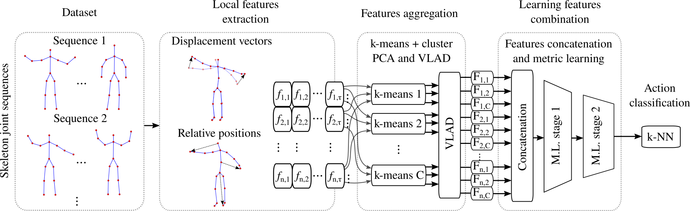

# HarSkel

## Human Action Recognition from Skeleton joints

This software is provided as additional material for the paper:
> Learning features combination for human action recognition from skeleton sequences



## Dependencies

*HarSkel* is a Matlab(r) software, but it does not depends on specific toolboxes.

Horever, it needs the following libraries (which are provided in the **3rdparty** folder):
* [LIBSVM](https://www.csie.ntu.edu.tw/~cjlin/libsvm/)
* [VLFeat](http://www.vlfeat.org/)

TO compile them (under Linux), do:
```sh
$ cd 3rdparty
$ ./build.sh
```

## Setting up

The file [setup.m](setup.m) configures the environment to run the software.
Consider taking a look at this file before running it. All the parameters and the dataset to be used are configured there.

## Datasets

We provided pre-computed skeleton sequences for all datasets supported:
* [MSR Action 3D](http://research.microsoft.com/en-us/um/people/zliu/ActionRecoRsrc)
* [UTKinect Action 3D](http://cvrc.ece.utexas.edu/KinectDatasets/HOJ3D.html)
* [Florence 3D Actions](https://www.micc.unifi.it/resources/datasets/florence-3d-actions-dataset)

If you want to recompute them, please check the file [recomp_skeletons.m](preprocessing/recomp_skeletons.m).

## Running examples

To reproduce the results reported in the paper, execute the file [train_and_eval.m](train_and_eval.m).
By default, the software is setted up for the MSR Action 3D dataset. The output should be as follows:

> >> train_and_eval
> pca: reduce features size from 8970 to 512
> Ep. 00000 | G 14867.1 | Eta 0 | N.Imp 26423 | Loss 30829.1 | Acc 83.2%
> Ep. 00001 | G 3477.25 | Eta 4.10069e-05 | N.Imp 12206 | Loss 11583.4 | Acc 89.4%
> Ep. 00002 | G 311.288 | Eta 0.000237151 | N.Imp 02924 | Loss 2456.4 | Acc 92.7%
> ...

## Citing

If this software is useful for you (or any part of it), please consider citing us:
```
@unpublished{Luvizon_2017,
Author = {Diogo C. Luvizon and Hedi Tabia and David Picard},
Title = {{Learning features combination for human action recognition from skeleton sequences}},
Year = {2017}
}
```

## License

MIT License
